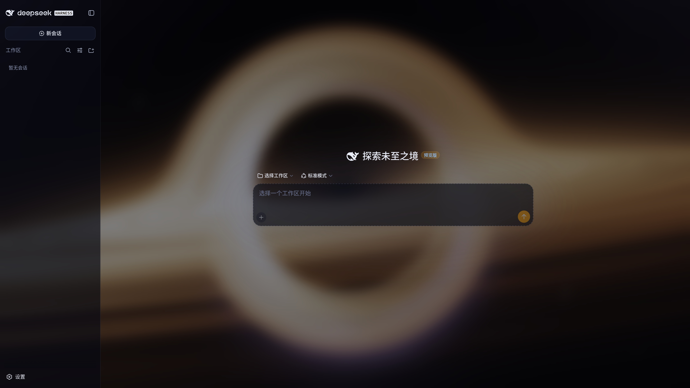

# dsh-theme-blackhole

[](LICENSE)


[English](README.md) | 中文

dsh（DeepSeek Harness）Web UI 的黑洞主题插件：以 WebGL 实时光线追踪的史瓦西黑洞作为应用背景，配合深空玻璃质感的面板调色板，从 设置 > 通用 > 主题-黑洞 一键切换。



## 特性

- **WebGL 史瓦西黑洞背景**：零测地线光线追踪实时渲染引力透镜、吸积盘与光子环，相机缓慢自动环绕
- **深空玻璃面板**：半透明深色令牌覆写 + 毛玻璃模糊，黑洞从内容之下柔焦透出，品牌强调色改为吸积盘琥珀
- **一等公民主题**：注册进主题运行时，设置行开关与外观设置双向同步、状态持久化，首屏无闪烁
- **性能友好且优雅降级**：半分辨率渲染、30fps 限速、遵循系统减少动态偏好，WebGL 不可用时透出纯黑深空底色

## 安装

本插件依赖 web profile 的 webServer 服务，仅适用于含 webserver 的 profile（如 web）， **不要装进 headless**。

```bash
dsh plugin --profile web add github:jiangwangyang/dsh-theme-blackhole
```

## 使用

安装并启动后，进入 **设置 > 通用 > 主题-黑洞**：

- **打开开关**：切换到黑洞主题，开关状态持久化，刷新或重启后仍保持
- **关闭开关**：恢复到你之前使用的内置主题（浅色 / 深色 / 跟随系统），原有偏好不会丢失
- **从外观行切走**：在外观设置中切回内置主题时，开关自动回写为关，两处设置始终一致

## 工作原理

### 整体架构

插件分为 Host 半边与客户端半边，加上两份静态资源：

| 部分       | 文件                   | 职责                                                                                                                  |
|------------|------------------------|-----------------------------------------------------------------------------------------------------------------------|
| Host 半边  | `src/index.js`         | 服务 `/blackhole/*` 静态资源（按请求读盘）；注册 `theme-blackhole` 设置命名空间；开关为开时向 index.html 注入首屏引导 |
| 客户端半边 | `src/client/index.js`  | 免构建 client bundle：把黑洞主题注册进 ThemeRuntime，注册设置行，按主题激活状态启停 DOM 视觉                          |
| 调色板     | `assets/blackhole.css` | `html[data-dsh-blackhole]` 门控的 `--dsw-*` 设计令牌覆写                                                              |
| 渲染器     | `assets/blackhole.js`  | 史瓦西黑洞 WebGL 渲染器，仅暴露 `window.DshBlackhole = { start, stop }` 控制器                                        |

### 首屏引导与门控机制

主题的全部视觉由 `html` 元素上的 `data-dsh-blackhole` 属性门控：属性存在时调色板覆写生效，移除后默认调色板完整恢复，无残留。

- 开关持久化为开时，Host 半边在 `</head>` 前注入激活标记、样式表与 defer 的渲染器脚本，避免客户端插件加载前闪默认主题；开关为关时不注入任何东西
- 客户端半边激活时认领导航中已存在的资源标签（携带同名标记），不重复插入；渲染器脚本只定义控制器，由客户端按 `theme/change` 事件幂等地 start/stop
- 黑洞主题 id 不进入 ui-theme 的内置设置 schema，开关持久化在插件自有的 `theme-blackhole.enabled` 命名空间——这是 dsh 对第三方主题保留的边界

### 黑洞渲染器（`assets/blackhole.js`）

渲染器为每个像素从相机发出一条光线，在史瓦西时空中做零测地线（光子轨迹）光线追踪，全部计算在片元着色器中完成。

**轨道方程与积分。** 史瓦西度规中角动量守恒把光线约束在过黑洞中心的平面内，因此无需积分完整的三维测地线方程。引入无量纲量 `u = r_s / r`（`r_s = 2M` 为史瓦西半径）后，测地线化为标量轨道方程：

```
d^2u/dphi^2 = 1.5 u^2 - u
```

其中 `phi` 为轨道平面内的方位角。着色器从相机位置与光线方向构造轨道平面正交基 `(a, b)`，由入射角给出初值 `u0` 与 `du/dphi`，随后用经典四阶 Runge-Kutta（RK4）积分，上限 420 步。步长随 `u` 自适应（`dphi = 0.04 / (1 + 2.5u)`）：越靠近黑洞步长越小，在强弯曲区域保证精度，远处不浪费算力。

积分的三种终止：

- `u <= 0`：光线逃逸至无穷远，采样星空背景
- `u >= 1`（`r < r_s`）：越过事件视界被捕获，该像素为黑
- 已过近日点向外且距离超过相机初始距离：提前逃逸判定，节省步数

**引力透镜。** 由于光线沿弯曲轨迹传播，单个像素对应的视线可能绕黑洞多圈，吸积盘的像因此出现在黑洞上下方（透镜像）并形成爱因斯坦环——这些效果不是后期贴图，而是测地线积分的自然结果。

**吸积盘。** 每步积分检测光线与盘面（倾角 20 度）的穿越（法向点积变号），线性插值定位交点后着色：

- 物质以开普勒角速度 `Omega = sqrt(M / r^3)` 旋转，ISCO（`3 r_s`）内侧为自由落体区，施加强剪切与内流
- 密度为切向拉伸的旋涡状 fbm 湍流噪声
- 温度分布 `T ~ r^(-3/4)`，并按天体物理标度 `T ~ M^(-1/4)` 随质量变化，颜色由近似黑体辐射谱给出

**相对论转移。** 吸积盘着色计入一阶相对论效应：

- **多普勒束流**：由开普勒速率计算多普勒因子 `dop = 1 / (gamma (1 - beta cos))`，朝向观测者运动的一侧显著增亮且蓝移，亮度含 `dop^3` 项
- **引力红移**：`g_grav = sqrt(1 - r_s / r)`，靠近视界的光子损失能量，颜色随总红移因子 `g = dop * g_grav` 物理地变化
- 自由落体区物质变暗变红，最终落入视界

**光子环辉光。** 记录每条光线的近日点距离，对近日点掠过光子球（`r = 1.5 r_s`）附近的光线叠加暖色辉光，勾勒出光子环轮廓。

**其余成分。** 盘上下方有指数衰减的体积热晕；星空背景由银河带星云（fbm 噪声）与两层哈希星点构成，且经过引力弯曲后采样，背景星空同样被透镜扭曲。最终颜色经曝光、ACES 色调映射与 gamma 校正输出。

**相机与性能。** 固定参数（质量 `M = 0.5`、相机距离 11、俯仰 0.38 rad、视场角 50 度），相机以 0.05 rad/s 缓慢自动环绕，无任何交互与可调项。性能策略：

- 渲染分辨率为 `0.5 x devicePixelRatio`（上限 2）倍窗口尺寸，半分辨率渲染兼顾性能与清晰度，由浏览器放大撑满全屏
- RAF 循环限速 30fps，只跳渲染不跳计时，环绕速度不受影响
- 系统开启减少动态偏好时仅渲染一帧静态画面，不启动循环
- WebGL 不可用或着色器编译失败时隐藏画布层，由 body 上的降级底色（纯黑 + 微弱吸积盘橙晕）透出
- stop 时取消 RAF、主动 `loseContext` 销毁 GL 上下文并移除画布层，不留痕迹

### 深空玻璃调色板（`assets/blackhole.css`）

全部规则由 `html[data-dsh-blackhole]` 门控，覆写 Web UI 的 `--dsw-*` 设计令牌：

- 画布层 `z-index: 0` 位于 body 背景之上、`#root` 之下；`#root` 施加 `backdrop-filter: blur(16px)`，半透明面板透过模糊后的黑洞看到柔焦深空
- 背景令牌改为分层半透明玻璃，越靠上的层（菜单、弹层、Toast）越不透明，保证可读性
- 品牌与交互强调色改为吸积盘琥珀（`rgb(245, 158, 11)`），文字为蓝白冷调梯度
- 同时设定 shiki 暗色代码高亮令牌，代码块使用近乎不透明的夜空底

## 项目结构

```
.
├── cordis.patch.yml      # bundle patch：声明插件 id 与名称
├── package.json          # exports、dsh.bundle / dsh.client 清单
├── src
│   ├── index.js          # Host 半边
│   └── client
│       └── index.js      # 客户端半边（免构建）
└── assets
    ├── blackhole.css     # 深空玻璃调色板
    └── blackhole.js      # WebGL 黑洞渲染器
```

## 许可证

[MIT](./LICENSE)
