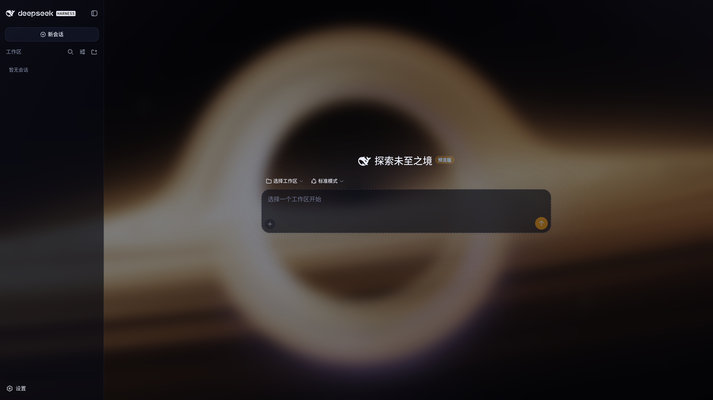

# dsh-theme-blackhole

[](https://awesome-dsh-plugin.com)
[](LICENSE)


[English](README.md) | 中文

DeepSeek Harness（dsh）Web UI 的黑洞主题插件：以 WebGL 实时光线追踪的史瓦西黑洞作为应用背景，配合深空玻璃质感的面板调色板。无开关：插件加载即启用，禁用或卸载插件即无残留还原默认主题。



## 特性

- **WebGL 史瓦西黑洞背景**：零测地线光线追踪实时渲染引力透镜、吸积盘与光子环，相机缓慢自动环绕
- **深空玻璃面板**：半透明深色令牌覆写 + 毛玻璃模糊，黑洞从内容之下柔焦透出，品牌强调色改为吸积盘琥珀
- **令牌覆盖层、加载即启用**：调色板经主题服务的令牌覆盖层（`ctx.theme.overrideTokens`）叠在当前主题之上，与 浅色/深色/跟随系统 偏好通道正交——不读写外观偏好，卸载插件即自动还原；样式与渲染器全部内联于 client bundle，无服务端路由、无 index.html 注入、无全局变量
- **性能友好且优雅降级**：半分辨率渲染、30fps 限速、遵循系统减少动态偏好，WebGL 不可用时透出纯黑深空底色

## 安装

本插件为纯浏览器侧呈现，无任何 Host 侧服务依赖。

要求 dsh ≥ 0.1.0-rc.7（该版本起主题服务提供令牌覆盖层 `ctx.theme.overrideTokens`）。本插件 0.1.x（带设置开关的旧版）要求 dsh ≥ 0.1.7。

```bash
dsh plugin --profile web add github:jiangwangyang/dsh-theme-blackhole
```

## 使用

没有设置开关：插件加载即启用黑洞主题。

- **关闭**：禁用或卸载插件（`dsh plugin --profile web remove dsh-theme-blackhole`），令牌覆盖层随之回收，DOM 痕迹全部摘除，你原有的外观偏好（浅色 / 深色 / 跟随系统）原样恢复
- **外观设置**：浅色/深色/跟随系统偏好仍可自由切换，黑洞调色板在任一档下渲染一致

## 工作原理

### 整体架构

主题为纯浏览器侧呈现：Host 半边是空实现（bundle 加载器要求每行都有 Node 半边），全部逻辑位于单个免构建 client bundle 中：

| 部分       | 位置 | 职责 |
|------------|------|------|
| Host 半边  | `src/index.js` | 空实现，仅导出稳定插件名 |
| 令牌覆盖层 | `PALETTE` / `TOKENS`（`src/client/index.js`） | 经 `ctx.theme.overrideTokens` 把深空玻璃调色板叠在当前主题之上 |
| 结构层     | `STRUCTURE_CSS`（内联样式表，原 `assets/blackhole.css`） | `html[data-dsh-blackhole]` 门控的画布层（自带柔焦与降级底色）、body 整页压暗黑纱与 shiki 令牌 |
| 渲染器     | `createBlackholeRenderer()`（内联，原 `assets/blackhole.js`） | 史瓦西黑洞 WebGL 渲染器，工厂返回 `{ start, stop }` 闭包控制器 |

### 门控机制

主题的结构层视觉由 `html` 元素上的 `data-dsh-blackhole` 属性门控：属性存在时画布层、毛玻璃与 shiki 令牌生效，移除后完整还原，无残留。

- 样式表与渲染器全部内联于 client bundle，随客户端插件加载到达——无静态资源路由、无 index.html 注入、无 `window` 全局控制器；代价是 bundle 加载前可能短暂闪现默认主题
- 调色板不在 CSS 中：客户端经 `ctx.theme.overrideTokens('blackhole', tokens)` 把令牌叠成覆盖层，由主题运行时以 body 内联变量写入并折叠进每次 `theme/change` 快照。覆盖层与 浅色/深色/跟随系统 偏好通道正交——不注册主题 id、不读写偏好——卸载插件时覆盖层自动回收
- 黑洞为单套深空色、在任一偏好档下渲染一致，客户端在每次 `theme/change` 后断言深色渲染基调（内联 `color-scheme: dark` 与暗色基底属性）——只写呈现、不碰持久化偏好——卸载时按偏好解析结果还原
- 渲染器为模块内闭包，客户端激活时 start；卸载时 stop（取消 RAF、销毁 GL 上下文、移除画布层）
### 黑洞渲染器（`createBlackholeRenderer`，内联于 `src/client/index.js`）

渲染器为每个像素从相机发出一条光线，在史瓦西时空中做零测地线（光子轨迹）光线追踪，全部计算在片元着色器中完成。

**轨道方程与积分。** 史瓦西度规中角动量守恒把光线约束在过黑洞中心的平面内，因此无需积分完整的三维测地线方程。引入无量纲量 `u = r_s / r`（`r_s = 2M` 为史瓦西半径）后，测地线化为标量轨道方程：

```
d^2u/dphi^2 = 1.5 u^2 - u
```

其中 `phi` 为轨道平面内的方位角。着色器从相机位置与光线方向构造轨道平面正交基 `(a, b)`，由入射角给出初值 `u0` 与 `du/dphi`，随后用经典四阶 Runge-Kutta（RK4）积分，上限 420 步。步长随 `u` 自适应（`dphi = 0.04 / (1 + 2.5u)`）：越靠近黑洞步长越小，在强弯曲区域保证精度，远处不浪费算力。

积分的三种终止：

- `u <= 0`：光线逃逸至无穷远，采样星空背景
- `u >= 1`（`r < r_s`）：越过事件视界被捕获，该像素为黑
- 已过近日点向外且距离超过相机初始距离：提前逃逸判定，节省步数

**引力透镜。** 由于光线沿弯曲轨迹传播，单个像素对应的视线可能绕黑洞多圈，吸积盘的像因此出现在黑洞上下方（透镜像）并形成爱因斯坦环——这些效果不是后期贴图，而是测地线积分的自然结果。

**吸积盘。** 每步积分检测光线与盘面（倾角 20 度）的穿越（法向点积变号），线性插值定位交点后着色：

- 物质以开普勒角速度 `Omega = sqrt(M / r^3)` 旋转，ISCO（`3 r_s`）内侧为自由落体区，施加强剪切与内流
- 密度为切向拉伸的旋涡状 fbm 湍流噪声
- 温度分布 `T ~ r^(-3/4)`，并按天体物理标度 `T ~ M^(-1/4)` 随质量变化，颜色由近似黑体辐射谱给出

**相对论转移。** 吸积盘着色计入一阶相对论效应：

- **多普勒束流**：由开普勒速率计算多普勒因子 `dop = 1 / (gamma (1 - beta cos))`，朝向观测者运动的一侧显著增亮且蓝移，亮度含 `dop^3` 项
- **引力红移**：`g_grav = sqrt(1 - r_s / r)`，靠近视界的光子损失能量，颜色随总红移因子 `g = dop * g_grav` 物理地变化
- 自由落体区物质变暗变红，最终落入视界

**光子环辉光。** 记录每条光线的近日点距离，对近日点掠过光子球（`r = 1.5 r_s`）附近的光线叠加暖色辉光，勾勒出光子环轮廓。

**其余成分。** 盘上下方有指数衰减的体积热晕；星空背景由银河带星云（fbm 噪声）与两层哈希星点构成，且经过引力弯曲后采样，背景星空同样被透镜扭曲。最终颜色经曝光、ACES 色调映射与 gamma 校正输出。

**相机与性能。** 固定参数（质量 `M = 0.5`、相机距离 11、俯仰 0.38 rad、视场角 50 度），相机以 0.05 rad/s 缓慢自动环绕，无任何交互与可调项。性能策略：

- 渲染分辨率为 `0.5 x devicePixelRatio`（上限 2）倍窗口尺寸，半分辨率渲染兼顾性能与清晰度，由浏览器放大撑满全屏
- RAF 循环限速 30fps，只跳渲染不跳计时，环绕速度不受影响
- 系统开启减少动态偏好时仅渲染一帧静态画面，不启动循环
- WebGL 不可用或着色器编译失败时只移除画布，画布层保留，其自带的纯黑深空降级底色透出
- stop 时取消 RAF、主动 `loseContext` 销毁 GL 上下文并移除画布层，不留痕迹

### 深空玻璃调色板（`PALETTE` 令牌覆盖层 + `STRUCTURE_CSS` 结构样式）

调色板以令牌覆盖层的形式覆写 Web UI 的 `--dsw-*` 设计令牌（经 `ctx.theme.overrideTokens` 叠放，每令牌对浅/深两档给出同值）；内联样式表 `STRUCTURE_CSS` 中的结构规则由 `html[data-dsh-blackhole]` 门控：

- 画布层 `z-index: -1` 沉到 body 与全部应用内容之下——不接触任何官方挂载节点，弹层/菜单/Toast 的排序语义不受影响；画布层自带降级底色与 `filter: blur(16px)` 柔焦，半透明面板透过它看到柔焦黑洞
- 背景令牌改为分层半透明玻璃，越靠上的层（菜单、弹层、Toast）越不透明，保证可读性；其中 `--dsw-alias-bg-base` 取全透明——应用外壳的多个全高容器（AppFrame、centerCol、会话骨架）会嵌套叠刷它，任一非零 alpha 都会复合成黑色遮罩盖住画布层；整页压暗由门控样式让 body 单独刷一层固定透明度的黑纱承担（body 只刷一次、不参与嵌套，无复合问题）
- 品牌与交互强调色改为吸积盘琥珀（`rgb(245, 158, 11)`），文字为蓝白冷调梯度
- 同时设定 shiki 暗色代码高亮令牌，代码块使用近乎不透明的夜空底

## 项目结构

```
.
├── cordis.patch.yml      # bundle patch：声明插件 id 与名称
├── package.json          # exports、dsh.bundle / dsh.client 清单
└── src
    ├── index.js          # Host 半边（空实现）
    └── client
        └── index.js      # 客户端半边（免构建单文件 bundle：调色板 + 结构层样式 + WebGL 渲染器）
```

## 许可证

[MIT](./LICENSE)
